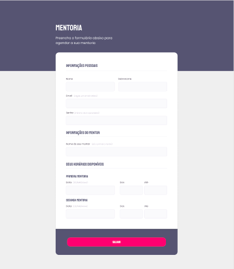

# Criando formulários - Stage 03 (Explorer)

### Linguagens usadas: HTML e CSS

=> Nesse desafio tinhamos que recriar uma aplicação de um formulário, a partir de um layout no Figma, servindo para o treinamento do que foi ensinado sobre formulários no Stage 03.

 

## Projeto finalizado

